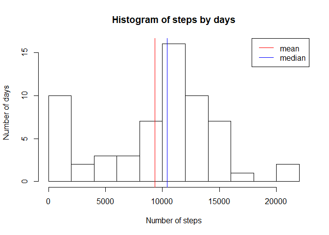
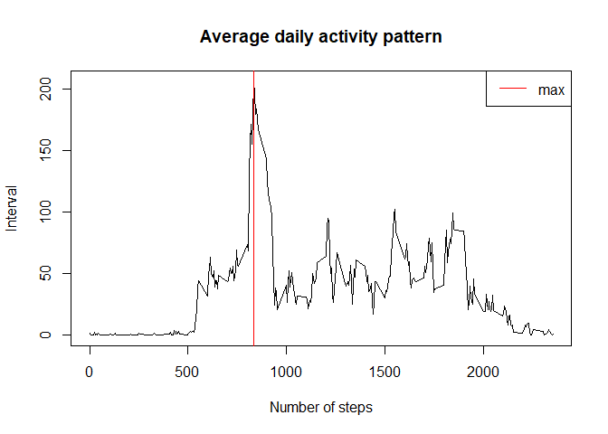
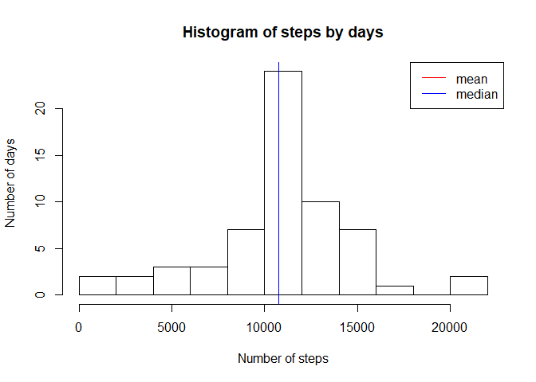
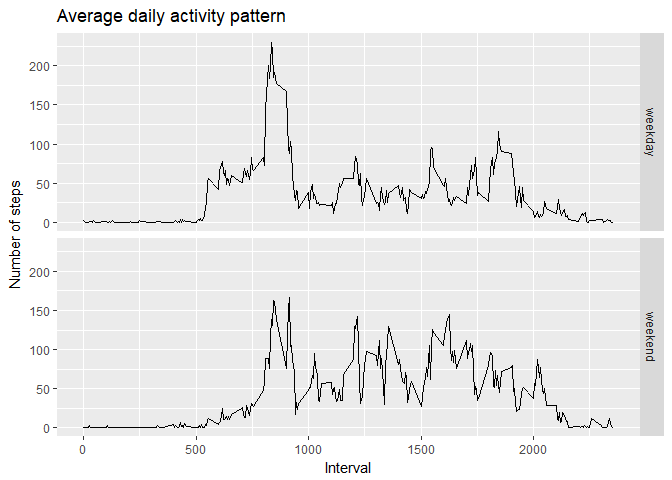

# Reproducible Research: Peer Assessment 1


## Loading and preprocessing the data

```r
activity.df <- read.csv(unz("activity.zip", "activity.csv"))
activity.df$date <- as.POSIXct(strptime(activity.df$date, "%Y-%m-%d"))
```


## What is mean total number of steps taken per day?

```r
stepsbydays <- aggregate(activity.df$steps, by = list(activity.df$date), sum, na.rm = T)
names(stepsbydays) <- c("date", "steps")
totalmeansteps <- mean(stepsbydays$steps)
totalmediansteps <- median(stepsbydays$steps)
p <- hist(stepsbydays$steps, breaks = 10,
          main = "Histogram of steps by days",
          xlab = "Number of steps", ylab = "Number of days")
abline(v = totalmeansteps, col = "red")
abline(v = totalmediansteps, col = "blue")
legend("topright", legend = c("mean", "median"), col = c("red", "blue"), lty = 1)
```

<!-- -->
The mean of the total number of steps per day is 9354.23. The median of the total number of steps per day is 10395.


## What is the average daily activity pattern?

```r
stepsbyintervals <- aggregate(activity.df$steps, by = list(activity.df$interval), mean, na.rm = T)
names(stepsbyintervals) <- c("interval", "steps")
maxinterval <- stepsbyintervals$interval[which.max(stepsbyintervals$steps)]
plot(stepsbyintervals$interval, stepsbyintervals$steps, type = "l",
     main = "Average daily activity pattern", 
     xlab = "Number of steps", ylab = "Interval")
abline(v = maxinterval, col = "red")
legend("topright", legend = "max", col = "red", lty = 1)
```

<!-- -->
The interval with the highest number of steps per 5-minute interval on average across all the days is 835.


## Imputing missing values

```r
numberofNA <- sum(is.na(activity.df$steps))
activity.df.imputed <- merge(activity.df, stepsbyintervals, by = "interval")
activity.df.imputed <- within(activity.df.imputed,
                              steps.x <- ifelse(is.na(activity.df.imputed$steps.x),
                                                activity.df.imputed$steps.y,
                                                activity.df.imputed$steps.x))
activity.df.imputed <- activity.df.imputed[,c("steps.x", "date", "interval")]
names(activity.df.imputed) <- names(activity.df)

stepsbydays.imputed <- aggregate(activity.df.imputed$steps, by = list(activity.df.imputed$date), sum, na.rm = T)
names(stepsbydays.imputed) <- c("date", "steps")
totalmeansteps.imputed <- mean(stepsbydays.imputed$steps)
totalmediansteps.imputed <- median(stepsbydays.imputed$steps)
p <- hist(stepsbydays.imputed$steps, breaks = 10,
          main = "Histogram of steps by days",
          xlab = "Number of steps", ylab = "Number of days")
abline(v = totalmeansteps.imputed, col = "red")
abline(v = totalmediansteps.imputed, col = "blue")
legend("topright", legend = c("mean", "median"), col = c("red", "blue"), lty = 1)
```

<!-- -->
The number of missing values in the dataset is 2304. 
After imputing the missing values the mean of the total number of steps per day is 10766.19. The median of the imputed total number of steps per day is 10766.19. The difference between the mean and the imputed mean is -1411.96. The difference between the mean and the imputed mean is -371.19. After imputing the missing values with the mean the median has become the mean. Also both the mean and the meadian have shrunk.


## Are there differences in activity patterns between weekdays and weekends?

```r
activity.df.imputed$weekday  <- as.factor(ifelse(weekdays(activity.df.imputed$date, F) %in% c("Saturday","Sunday"), "weekend", "weekday")) 

stepsbyintervals.weekend <- aggregate(list(steps = activity.df.imputed$steps),
    by = list(activity.df.imputed[,c("interval", "weekday")])[[1]], mean)

library(ggplot2)
qplot(x = interval, y = steps, facets = weekday ~ .,
      data = stepsbyintervals.weekend, geom = "path",
      main = "Average daily activity pattern",
      xlab = "Interval", ylab = "Number of steps")
```

<!-- -->
